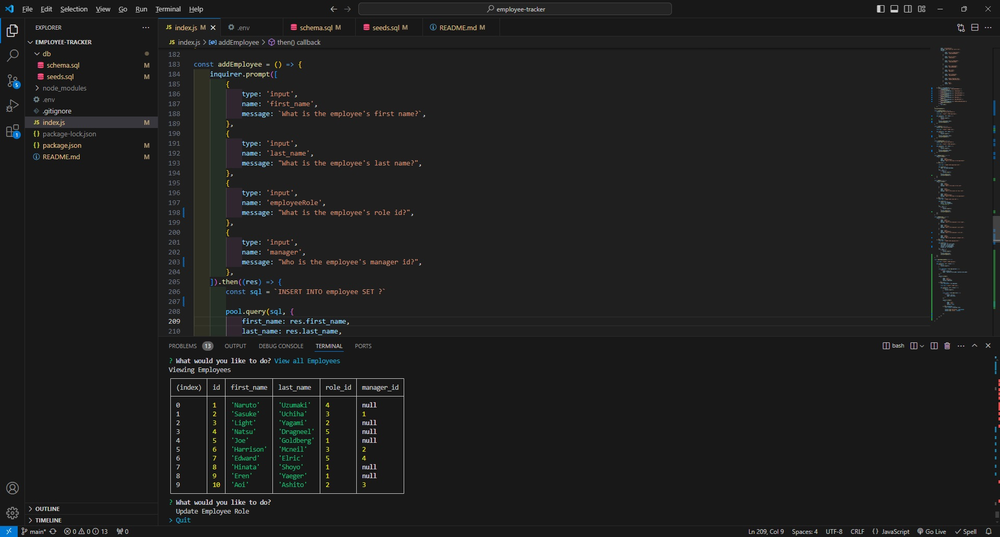

# Employee-Tracker

# Table of Contents: 
- [User Story](#user-story)
- [Description](#description)
- [Challenges](#challenges)
- [Screenshot](#screenshot-of-employee-tracker)
- [Deployable link](#recording-of-application)

# User Story:
AS A business owner
I WANT to be able to view and manage the departments, roles, and employees in my company
SO THAT I can organize and plan my business

# Description: 
The goal of this project was to create a command line application that can accept user inputs.  The application would allow a business owner to be able to view departments, roles, and employees in a organized manner.  It also allows business owners to make changes to the department, roles, employees, salaries, and anything else associated with the business.  The application is able to display tables and make changes to tables according to the user.  

# Challenges:
There were many challenges that emerged while creating this project.  One of those challenges was creating a function that could make changes to the table.  Another challenge was creating a function that could update employee information  by the role id.  

# Screenshot of Employee Tracker:

# Recording of Application:

[Link of Application](https://drive.google.com/file/d/1Gg7PTTQAQIraKr1jrQxc6jsU5X5CdqRd/view?usp=sharing)